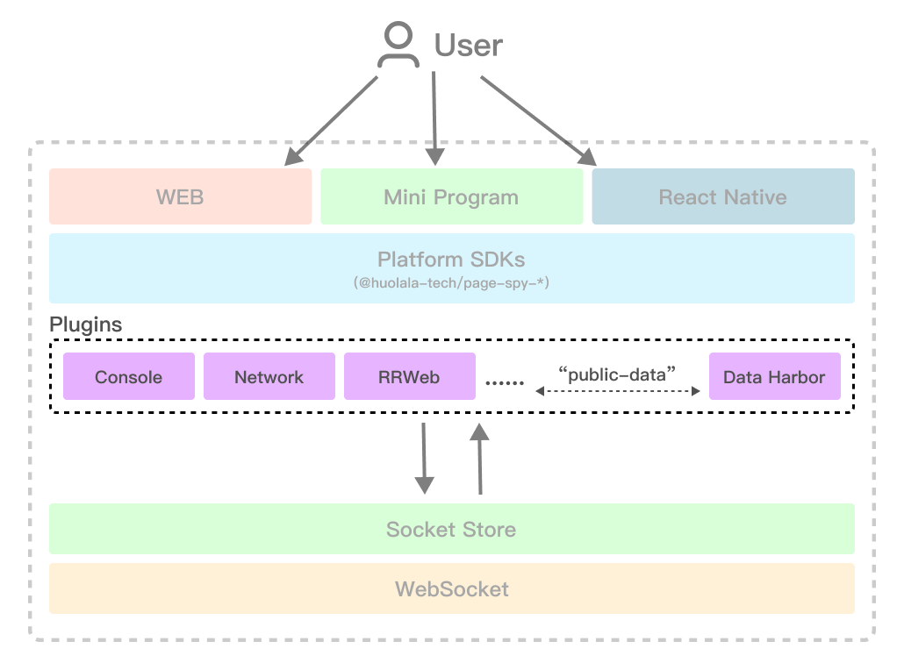

English | [中文](./plugin_zh.md)

# Plugins



## SDK that supports plugin registration

- `@huolala-tech/page-spy-browser@^1.7.0`;
- `@huolala-tech/page-spy-wechat@^1.7.0`;
- `@huolala-tech/page-spy-uniapp@^1.7.0`;

## Official plugins

- [`@huolala-tech/page-spy-plugin-rrweb`](../packages/page-spy-plugin-rrweb): use `rrweb` to record the DOM mutation;
- [`@huolala-tech/page-spy-plugin-data-harbor`](../packages/page-spy-plugin-data-harbor): providing offline caching and data downloading capabilities;

## Definition of a Plugin

```ts
import { SocketStoreType } from '@huolala-tech/page-spy-types/lib/base';
import { PluginOrder } from '@huolala-tech/page-spy-types';
import { InitConfig } from 'types';

export abstract class PageSpyPlugin {
  /**
   * Each plugin requires a specified name, serving as the "identity" of the current plugin.
   * The functionalities of registering and disabling plugins within PageSpy rely on the name property.
   */
  public abstract name: string;

  /**
   * Specify the plugin ordering. The plugin invocation will be in the following order:
   *   1. Plugins with `enforce: "pre"`;
   *   2. Plugins without enforce value;
   *   3. Plugins with `enforce: "post"`;
   */
  public abstract enforce?: PluginOrder;

  // Called when `new PageSpy()` is invoked.
  public abstract onInit: (params: OnInitParams) => any;

  // Called after the rendering of PageSpy is completed (if there is a rendering process).
  public abstract onMounted?: (params: OnMountedParams) => any;

  // When PageSpy is no longer needed, plugins should have a reset/recovery functionality.
  public abstract onReset?: () => any;
}

export interface OnInitParams {
  // Merged configuration information about PageSpy instantiation parameters provided by the user.
  config: Required<InitConfig>;

  // Wraps the socket instance, allowing plugin developers to interact with the debugging terminal/API through this property.
  socketStore: SocketStoreType;
}

export interface OnMountedParams {
  // Root node of the PageSpy rendering
  root?: HTMLDivElement;

  // Root node of the PageSpy rendering pop-up
  content?: HTMLDivElement;

  // Wraps the socket instance, allowing plugin developers to interact with the debugging terminal/API through this property.
  socketStore: SocketStoreType;
}
```

## Behavioral Conventions

If the current plugin collects (or wishes to publicly expose) some form of "data" regarding platform behavior, in addition to broadcasting data on `socketStore`, we conventionally dispatch an "public-data" internal event on the `socketStore` instance. This is done to meet the needs of plugins that require statistics or persistent data, allowing them to uniformly collect data from this event. If a plugin feels that certain data should not be "publicly" exposed, there is no need to dispatch the "public-data" event.

## Plugin Implementation Example

> [!NOTE]
> The following content is just an example.

Use case: Recording DOM on the client-side using rrweb, including:

- Adding a "Download Recording Data" button in the client-side popup; clicking the button initiates the file download.
- Listening for event messages from the debugging terminal and interacting with the debugging terminal.

```ts
import { record } from 'rrweb';
import { eventWithTime } from '@rrweb/types';
import {
  SpyMessage,
  PageSpyPlugin,
  OnInitParams,
  OnMountedParams,
} from '@huolala-tech/page-spy-types';

type Options = Parameters<typeof record>[number];

export default class XXXPlugin implements PageSpyPlugin {
  name = 'XXXPlugin';

  events: eventWithTime[] = [];

  private static hasInited = false;

  private static hasMounted = false;

  constructor(public options: Options = {}) {}

  onInit({ socketStore }: OnInitParams) {
    if (XXXPlugin.hasInited) return;
    XXXPlugin.hasInited = true;

    record({
      ...this.options,
      emit(event) {
        // Construct the data to be sent out
        const message: SpyMessage.MessageItem = {
          type: 'rrweb-event',
          role: 'client',
          data: event,
        };
        // Broadcast data through socketStore
        socketStore.broadcastMessage(message);
        // Simultaneously dispatch the "public-data" event
        socketStore.dispatchEvent('public-data', message);
      },
    });

    // Listen for events sent from the debugging terminal
    // Assuming "rrweb-cache" is a ws "event" message sent by the debugging terminal
    socketStore.addListener('rrweb-cache', ({ source }, reply) => {
      // source.data - Parameters sent by the debugging terminal
      const params = source.data;
      // Plugin processing logic
      // const result: SpyMessage.MessageItem = ...
      // Call reply(...), and socketStore will be responsible for unicasting the data to the specified debugging terminal
      reply(result);
    });
  }

  onMounted({ content, socketStore }: OnMountedParams) {
    if (XXXPlugin.hasMounted) return;
    XXXPlugin.hasMounted = true;

    const recordBtn = document.createElement('div');
    recordBtn.id = 'download-rrweb-event';
    // "page-spy-content__btn" class can reuse button styles
    recordBtn.className = 'page-spy-content__btn';
    recordBtn.innerText = 'Download Recording Data';
    recordBtn.addEventListener('click', () => {
      const data = new Blob([JSON.stringify(this.events)], {
        type: 'application/json',
      });
      const url = URL.createObjectURL(data);

      const a = document.createElement('a');
      a.download = `${new Date().toLocaleString()}.json`;
      a.href = url;
      a.style.display = 'none';
      document.body.appendChild(a);
      a.click();

      URL.revokeObjectURL(url);
      document.body.removeChild(a);
    });

    content.appendChild(recordBtn);
  }

  // When $pageSpy.abort() is called, `onReset()` is triggered
  onReset() {
    XXXPlugin.hasInited = false;
    XXXPlugin.hasMounted = false;
    const root = document.getElementById('download-rrweb-event');
    if (root) {
      root.remove();
    }
  }
}
```

## Usage of the Plugin

```html
<!-- Include SDK -->
<script src="https://<your-host>/page-spy/index.min.js"></script>
<!-- Include the plugin -->
<script src="https://<your-host>/plugin/xxx/index.min.js"></script>

<!-- Register the plugin -->
<script>
  PageSpy.registerPlugin(new XXXPlugin());
  window.$pageSpy = new PageSpy();
</script>
```
