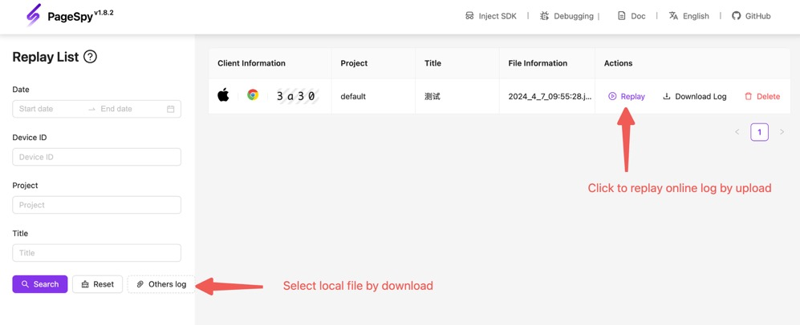

[npm-image]: https://img.shields.io/npm/v/@huolala-tech/page-spy-plugin-data-harbor?logo=npm&label=version
[npm-url]: https://www.npmjs.com/package/@huolala-tech/page-spy-plugin-data-harbor
[minified-image]: https://img.shields.io/bundlephobia/min/@huolala-tech/page-spy-plugin-data-harbor
[minified-url]: https://unpkg.com/browse/@huolala-tech/page-spy-plugin-data-harbor/dist/iife/index.min.js

English | [中文](./README_ZH.md)

# `@huolala-tech/page-spy-plugin-data-harbor`

[![SDK version][npm-image]][npm-url]
[![SDK size][minified-image]][minified-url]

The `DataHarborPlugin` can be used in browser environment, providing offline caching and data downloading capabilities.

In the past, remote debugging had a prerequisite that "both the client and debugging server must be online simultaneously." By utilizing the `DataHarborPlugin`, it internally listens for the `"public-data"` event ([what is the `public-data` event?](../../docs/plugin.md#behavioral-conventions)), allowing the offline caching of data. This innovation breaks the previous prerequisite of both the client and debugging server needing to be online simultaneously. When issues are identified by the client, testing colleagues can directly export the data, marking a significant departure from the historical requirement of simultaneous online status for both the client and debugging server.

`DataHarborPlugin` starts collecting data when `new PageSpy()` is called. The collected data is stored in client-side memory. When the accumulated data volume reaches 10MB (default value, specified by `maximum`), the data is temporarily stored by generating an Object URL through `URL.createObjectUrl()` and then new data collection continues.

## Definition

```ts
import { PageSpyPlugin } from '@huolala-tech/page-spy-types';

type DataType = 'console' | 'network' | 'system' | 'storage' | 'rrweb-event';

interface DataHarborConfig {
  // Specify the maximum bytes of single harbor's container.
  // Default 10 * 1024 * 1024.
  maximum?: number;

  // Specify which types of data should be collected
  caredData?: Record<DataType, boolean>;

  // Customize the log's filename
  filename?: () => string;

  // Customize the "Download Log Data"
  // (Version required: @huolala-tech/page-spy-plugin-data-harbor^1.0.6)
  onDownload?: (data: CacheMessageItem[]) => void;
}

declare class DataHarborPlugin implements PageSpyPlugin {
  constructor(config?: DataHarborConfig);
}

export default DataHarborPlugin;
```

## Usage

### Load plugin

- Options 1: Load with script

  ```html
  <html>
    <head>
      <!-- 1. Load PageSpy -->
      <script src="https://<your-host>/page-spy/index.min.js"></script>
      <!-- 2. Load the plugin -->
      <script src="https://<your-host>/plugin/data-harbor/index.min.js"></script>
      <!-- 3. Register plugin && Init PageSpy -->
      <script>
        // Register plugin
        window.$harbor = new DataHarborPlugin(config: DataHarborConfig);
        PageSpy.registerPlugin(window.$harbor);
        // Init PageSpy
        window.$pageSpy = new PageSpy();
      </script>
    </head>
  </html>
  ```

- Option 2: Import within ESM

  ```ts
  // In your entry file like "main.ts"
  import PageSpy from '@huolala-tech/page-spy-browser';
  import DataHarborPlugin from '@huolala-tech/page-spy-plugin-data-harbor';

  // Register plugin
  window.$harbor = new DataHarborPlugin(config: DataHarborConfig);
  PageSpy.registerPlugin(window.$harbor);
  // Init PageSpy
  window.$pageSpy = new PageSpy();
  ```

### Upload / download data

Upon successful integration, the popup that appears after clicking on the floating ball should include `download / upload` buttons.


If setting `autoRender: false` when instantiating PageSpy hides the controls, but you still want the client to be able to upload/download without any action required, you can manipulate it by sending the following code on the debugging panel:

```js
// upload
const url = await window.$harbor.onOfflineLog('upload');

// download
window.$harbor.onOfflineLog('download');
```

### Replay log

Goto the debugger's log list page and click the "Replay log" button, select the file uploaded / downloaded in prev step, now you can use the replay to debug.


