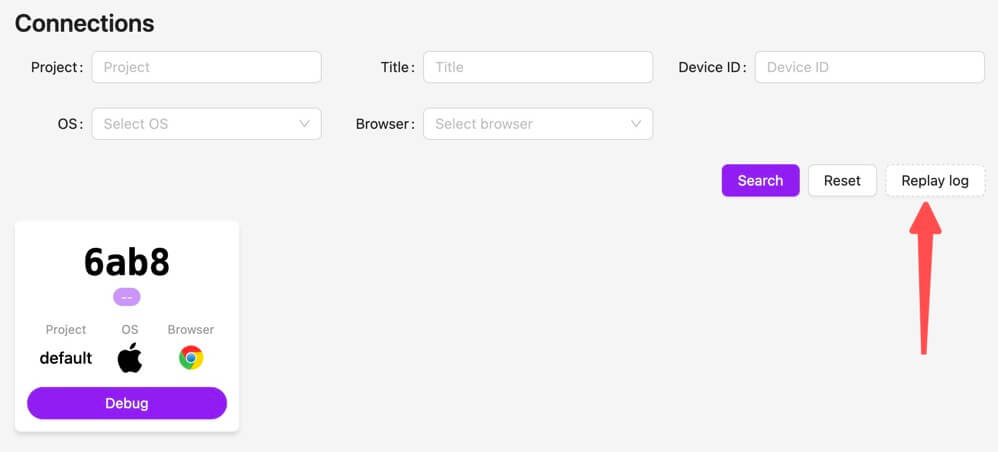

[npm-image]: https://img.shields.io/npm/v/@huolala-tech/page-spy-plugin-data-harbor?logo=npm&label=version
[npm-url]: https://www.npmjs.com/package/@huolala-tech/page-spy-plugin-data-harbor
[minified-image]: https://img.shields.io/bundlephobia/min/@huolala-tech/page-spy-plugin-data-harbor
[minified-url]: https://unpkg.com/browse/@huolala-tech/page-spy-plugin-data-harbor/dist/iife/index.min.js

English | [中文](./README_ZH.md)

# `@huolala-tech/page-spy-plugin-data-harbor`

[![SDK version][npm-image]][npm-url]
[![SDK size][minified-image]][minified-url]

The `DataHarborPlugin` can be used in browser environment, providing offline caching and data downloading capabilities.

In the past, remote debugging had a prerequisite that "both the client and debugging server must be online simultaneously." By utilizing the `DataHarborPlugin`, it internally listens for the `"public-data"` event ([what is the `public-data` event?](../../docs/plugin.md#behavioral-conventions)), allowing the offline caching of data. This innovation breaks the previous prerequisite of both the client and debugging server needing to be online simultaneously. When issues are identified by the client, testing colleagues can directly export the data, marking a significant departure from the historical requirement of simultaneous online status for both the client and debugging server.

`DataHarborPlugin` defaults to storing data in `indexedDB` and does not impose any limitations on the quantity of cached data; these behaviors can be configured during plugin initialization. If a data limit is specified by `maximum` field, the cached data will not exceed this value. Prior to page unload (`"beforeunload"`), cached data is discarded and re-cached.

## Definition

```ts
import { PageSpyPlugin } from '@huolala-tech/page-spy-types';

type DataType = 'console' | 'network' | 'rrweb-event';
type SaveAs = 'indexedDB' | 'memory';

interface DataHarborConfig {
  maximum?: number;
  saveAs?: SaveAs;
  caredData?: Record<DataType, boolean>;
}

declare class DataHarborPlugin implements PageSpyPlugin {
  constructor(config?: DataHarborConfig);
}

export default DataHarborPlugin;
```

## Usage

### Load plugin

- Options 1: Load with script

  ```html
  <html>
    <head>
      <!-- 1. Load PageSpy -->
      <script src="https://<your-host>/page-spy/index.min.js"></script>
      <!-- 2. Load the plugin -->
      <script src="https://<your-host>/plugin/data-harbor/index.min.js"></script>
      <!-- 3. Register plugin && Init PageSpy -->
      <script>
        // Register plugin
        PageSpy.registerPlugin(new DataHarborPlugin(config));
        // Init PageSpy
        window.$pageSpy = new PageSpy();
      </script>
    </head>
  </html>
  ```

- Option 2: Import within ESM

  ```ts
  // In your entry file like "main.ts"
  import PageSpy from '@huolala-tech/page-spy-browser';
  import DataHarborPlugin from '@huolala-tech/page-spy-plugin-data-harbor';

  // Register plugin
  PageSpy.registerPlugin(new DataHarborPlugin(config));
  // Init PageSpy
  window.$pageSpy = new PageSpy();
  ```

### Export data

Upon successful integration, the popup that appears after clicking on the client-side rendering control should include a "Download Log Data" button. Clicking on this button will initiate the export of JSON data file.


### Replay log

Goto the debugger's room list page and click the "Replay log" button, select the file exported in prev step, now you can use the replay to debug.


