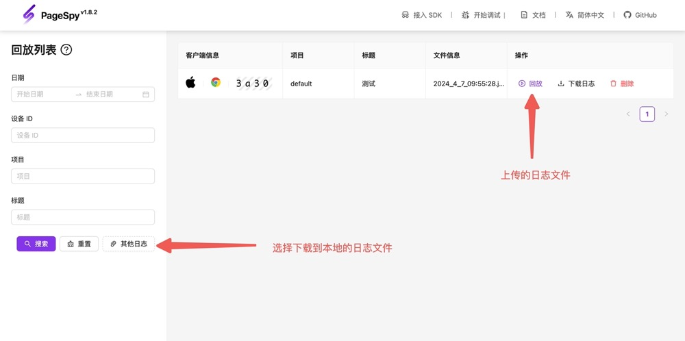

[npm-image]: https://img.shields.io/npm/v/@huolala-tech/page-spy-plugin-data-harbor?logo=npm&label=version
[npm-url]: https://www.npmjs.com/package/@huolala-tech/page-spy-plugin-data-harbor
[minified-image]: https://img.shields.io/bundlephobia/min/@huolala-tech/page-spy-plugin-data-harbor
[minified-url]: https://unpkg.com/browse/@huolala-tech/page-spy-plugin-data-harbor/dist/iife/index.min.js

[English](./README.md) | 中文

# `@huolala-tech/page-spy-plugin-data-harbor`

[![SDK version][npm-image]][npm-url]
[![SDK size][minified-image]][minified-url]

`DataHarborPlugin` 插件当前可用于浏览器环境，提供离线缓存和下载数据功能。

以往，远程调试存在一个前提条件，即「客户端和调试端必须同时在线」。通过使用 `DataHarborPlugin` 插件，它在内部监听 `"public-data"` 事件（[什么是 `public-data` 事件？](../../docs/plugin_zh.md#行为约定)），现在可以实现离线缓存数据的功能。当客户端发现问题时，测试同学可以直接导出数据，这一创新打破了以往「客户端和调试端必须同时在线」的前提要求。

`DataHarborPlugin` 会在 `new PageSpy()` 的时候开始收集数据，收集的数据都会放在客户端内存中，当数据体积累计达到 10MB 时（默认值，可通过 `maximum` 指定），将数据通过 `URL.createObjectUrl()` 生成 Object URL 暂存，并继续收集新的数据。

## 类型定义

```ts
import { PageSpyPlugin } from '@huolala-tech/page-spy-types';

type DataType = 'console' | 'network' | 'system' | 'storage' | 'rrweb-event';

interface DataHarborConfig {
  // 指定单个 “集装箱” 中可存储的最大字节数
  // 默认值 10 * 1024 * 1024
  maximum?: number;

  // 指定应该收集哪些类型的数据
  caredData?: Record<DataType, boolean>;

  // 自定义日志文件的名称
  filename?: () => string;

  // 自定义「下载日志数据」行为
  // (版本要求: @huolala-tech/page-spy-plugin-data-harbor^1.0.6)
  onDownload?: (data: CacheMessageItem[]) => void;
}

declare class DataHarborPlugin implements PageSpyPlugin {
  constructor(config?: DataHarborConfig);
}

export default DataHarborPlugin;
```

## 使用

### 加载插件

- 方式 1：使用 `<script>` 加载

  ```html
  <html>
    <head>
      <!-- 1. 加载 PageSpy -->
      <script src="https://<your-host>/page-spy/index.min.js"></script>
      <!-- 2. 加载插件 -->
      <script src="https://<your-host>/plugin/data-harbor/index.min.js"></script>
      <!-- 3. 注册插件 && 实例化 PageSpy -->
      <script>
        // 注册插件
        window.$harbor = new DataHarborPlugin(config: DataHarborConfig);
        PageSpy.registerPlugin(window.$harbor);
        // 实例化
        window.$pageSpy = new PageSpy();
      </script>
    </head>
  </html>
  ```

- 方式 2：使用 `import` 导入

  ```ts
  // 在你的入口文件中（如 "main.ts"）导入
  import PageSpy from '@huolala-tech/page-spy-browser';
  import DataHarborPlugin from '@huolala-tech/page-spy-plugin-data-harbor';

  // 注册插件
  window.$harbor = new DataHarborPlugin(config: DataHarborConfig);
  PageSpy.registerPlugin(window.$harbor);
  // 实例化 PageSpy
  window.$pageSpy = new PageSpy();
  ```

### 上传 / 导出数据

引入成功后页面右下方会出现 PageSpy 的悬浮球，点击悬浮球出现的弹窗中应该包含了上传和下载的按钮。


如果在实例化 PageSpy 的时候设置 `autoRender: false` 隐藏了控件，又希望被调试的客户端无需操作也可以上传 / 下载，你可以在调试端面板上通过发送以下代码来操作：

```js
// 上传
const url = await window.$harbor.onOfflineLog('upload');

// 下载
window.$harbor.onOfflineLog('donwload');
```

### 日志数据回放

进入调试端，点击「开始调试 - 日志回放」，选择上一步上传 / 下载的 json 数据即可开始使用回放功能！


