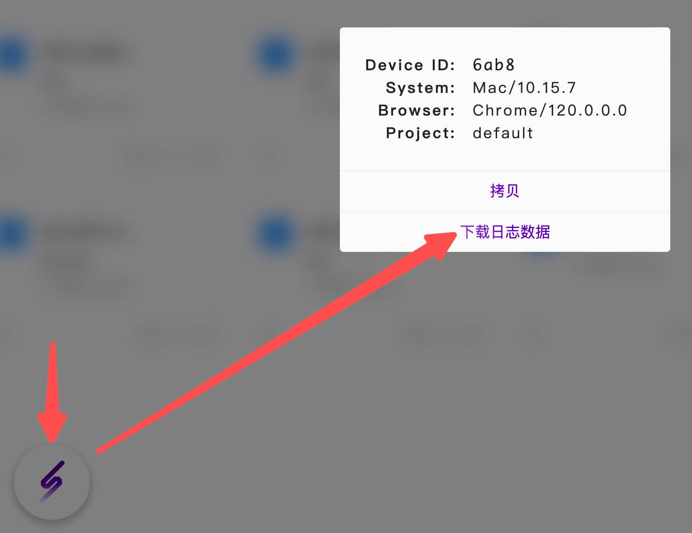
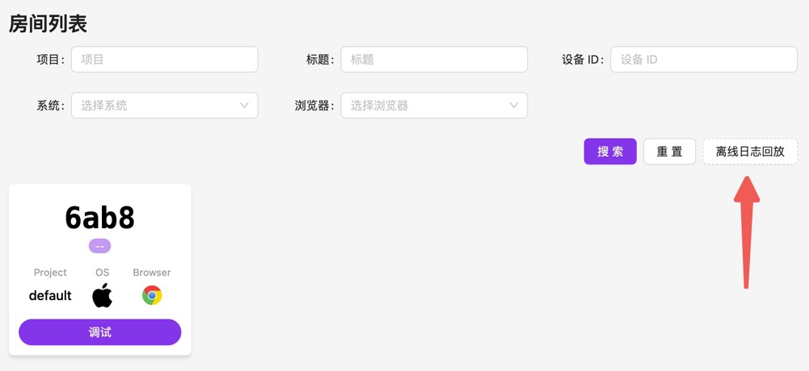

[npm-image]: https://img.shields.io/npm/v/@huolala-tech/page-spy-plugin-data-harbor?logo=npm&label=version
[npm-url]: https://www.npmjs.com/package/@huolala-tech/page-spy-plugin-data-harbor
[minified-image]: https://img.shields.io/bundlephobia/min/@huolala-tech/page-spy-plugin-data-harbor
[minified-url]: https://unpkg.com/browse/@huolala-tech/page-spy-plugin-data-harbor/dist/iife/index.min.js

[English](./README.md) | 中文

# `@huolala-tech/page-spy-plugin-data-harbor`

[![SDK version][npm-image]][npm-url]
[![SDK size][minified-image]][minified-url]

`DataHarborPlugin` 插件当前可用于浏览器环境，提供离线缓存和下载数据功能。

以往，远程调试存在一个前提条件，即「客户端和调试端必须同时在线」。通过使用 `DataHarborPlugin` 插件，它在内部监听 `"public-data"` 事件（[什么是 `public-data` 事件？](../../docs/plugin_zh.md#行为约定)），现在可以实现离线缓存数据的功能。当客户端发现问题时，测试同学可以直接导出数据，这一创新打破了以往「客户端和调试端必须同时在线」的前提要求。

`DataHarborPlugin` 默认将数据存储在 `indexedDB` 中，且不限制缓存数据的数量，这些行为都可在初始化插件时进行配置。如果指定了最大数据量 `maximum`，则缓存的数据量不会超过该值。

`DataHarborPlugin` 会在 `new PageSpy()` 的时候开始录制，默认情况下不会结束，除非你指定了最多缓存多少条数据、或者触发了重新实例化插件，`DataHarborPlugin` 插件在每次实例化时，已缓存的数据都将被丢弃并重新缓存。

## 类型定义

```ts
import { PageSpyPlugin } from '@huolala-tech/page-spy-types';

type DataType = 'console' | 'network' | 'rrweb-event';
type SaveAs = 'indexedDB' | 'memory';

interface DataHarborConfig {
  // 指定最多缓存多少条数据
  // 默认值 0，不限制
  maximum?: number;

  // 指定缓存在什么位置
  // 默认值："indexedDB"
  saveAs?: SaveAs;

  // 指定应该收集哪些类型的数据
  caredData?: Record<DataType, boolean>;

  // 自定义「下载日志数据」行为
  // (版本要求: @huolala-tech/page-spy-plugin-data-harbor^1.0.6)
  onDownload?: (data: CacheMessageItem[]) => void;
}

declare class DataHarborPlugin implements PageSpyPlugin {
  constructor(config?: DataHarborConfig);
}

export default DataHarborPlugin;
```

## 使用

### 加载插件

- 方式 1：使用 `<script>` 加载

  ```html
  <html>
    <head>
      <!-- 1. 加载 PageSpy -->
      <script src="https://<your-host>/page-spy/index.min.js"></script>
      <!-- 2. 加载插件 -->
      <script src="https://<your-host>/plugin/data-harbor/index.min.js"></script>
      <!-- 3. 注册插件 && 实例化 PageSpy -->
      <script>
        // 注册插件
        PageSpy.registerPlugin(new DataHarborPlugin(config));
        // 实例化
        window.$pageSpy = new PageSpy();
      </script>
    </head>
  </html>
  ```

- 方式 2：使用 `import` 导入

  ```ts
  // 在你的入口文件中（如 "main.ts"）导入
  import PageSpy from '@huolala-tech/page-spy-browser';
  import DataHarborPlugin from '@huolala-tech/page-spy-plugin-data-harbor';

  // 注册插件
  PageSpy.registerPlugin(new DataHarborPlugin(config));
  // 实例化 PageSpy
  window.$pageSpy = new PageSpy();
  ```

### 导出数据

引入成功后，点击客户端渲染的控件后出现的弹窗中应该包含「下载日志数据」按钮，点击后会导出 json 数据。



### 离线数据回放

点击「日志回放」，选择上一步中导出的 json 数据即可开始使用回放功能！


