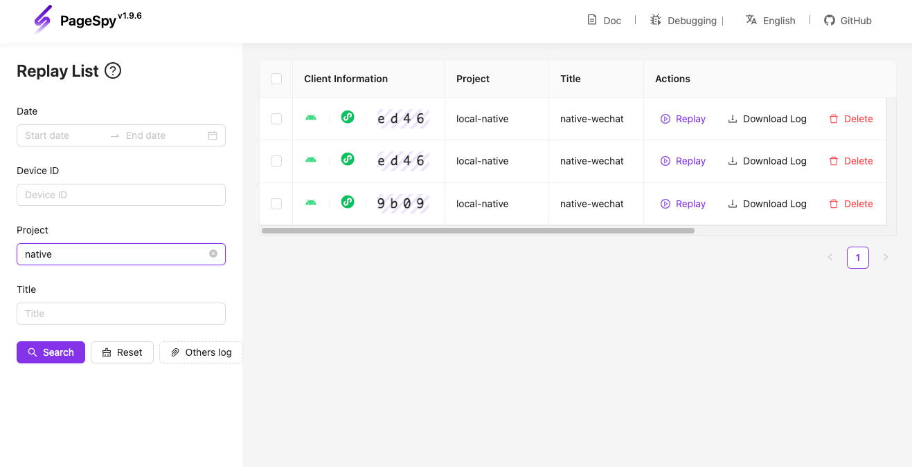

[npm-image]: https://img.shields.io/npm/v/@huolala-tech/page-spy-plugin-mp-data-harbor?logo=npm&label=version
[npm-url]: https://www.npmjs.com/package/@huolala-tech/page-spy-plugin-mp-data-harbor
[minified-image]: https://img.shields.io/bundlephobia/min/@huolala-tech/page-spy-plugin-mp-data-harbor
[minified-url]: https://unpkg.com/browse/@huolala-tech/page-spy-plugin-mp-data-harbor/dist/esm/index.min.js

English | [中文](./README_ZH.md)

# `@huolala-tech/page-spy-plugin-mp-data-harbor`

[![SDK version][npm-image]][npm-url]
[![SDK size][minified-image]][minified-url]

This plugin is used in miniprogram environment, providing offline caching and data downloading capabilities.

In the past, remote debugging had a prerequisite that "both the client and debugging server must be online simultaneously." By utilizing the `mp-data-harbor` plugin, it internally listens for the `"public-data"` event ([what is the `public-data` event?](../../docs/plugin.md#behavioral-conventions)), allowing the offline caching of data. This innovation breaks the previous prerequisite of both the client and debugging server needing to be online simultaneously. When issues are identified by the client, testing colleagues can directly upload the data, marking a significant departure from the historical requirement of simultaneous online status for both the client and debugging server.

`mp-data-harbor` plugin starts collecting data when `new PageSpy()` is called. The collected data is stored in client-side memory.

## Definition

```ts
import { PageSpyPlugin } from '@huolala-tech/page-spy-types';

type DataType = 'console' | 'network' | 'system' | 'storage';

interface DataHarborConfig {
  // Specify which types of data should be collected
  caredData?: Record<DataType, boolean>;

  // Customize the log's filename
  filename?: () => string;
}

declare class DataHarborPlugin implements PageSpyPlugin {
  constructor(config?: DataHarborConfig);
}

export default DataHarborPlugin;
```

## Usage

### Load plugin

```ts
import PageSpy from '@huolala-tech/page-spy-uniapp';
// Import the plugin in your entry file like "main.ts".
import DataHarborPlugin from '@huolala-tech/page-spy-plugin-mp-data-harbor';

// Init and register the plugin before the PageSpy sdk initiated.
const harbor = new DataHarborPlugin(config);
PageSpy.registerPlugin(harbor);

// Init PageSpy
new PageSpy();
```

### Upload data

There are 2 ways to upload the offline data:

1. call `upload` method of the plugin:

```js
harbor.plugin.upload().then((res) => {
  conssole.log('upload successfully');
});
```

2. Upload via PageSpy's control panel:

With the `mp-data-harbor` plugin, there will be an upload button in the PageSpy control panel.


### Replay log

Goto the debugger's log list page and click the "Replay log" button, select the file uploaded in prev step, now you can use the replay to debug.


