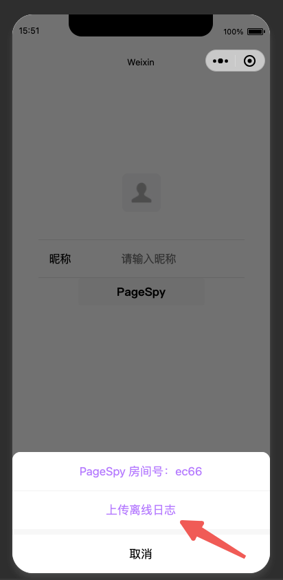
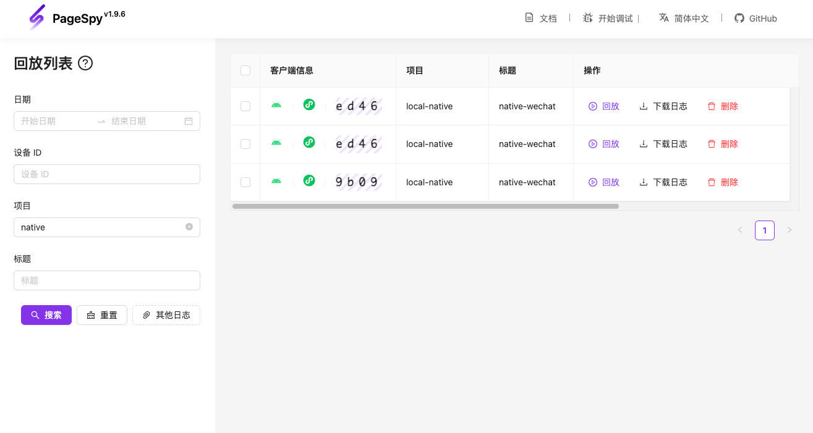

[npm-image]: https://img.shields.io/npm/v/@huolala-tech/page-spy-plugin-mp-data-harbor?logo=npm&label=version
[npm-url]: https://www.npmjs.com/package/@huolala-tech/page-spy-plugin-mp-data-harbor
[minified-image]: https://img.shields.io/bundlephobia/min/@huolala-tech/page-spy-plugin-mp-data-harbor
[minified-url]: https://unpkg.com/browse/@huolala-tech/page-spy-plugin-mp-data-harbor/dist/iife/index.min.js

[English](./README.md) | 中文

# `@huolala-tech/page-spy-plugin-mp-data-harbor`

[![SDK version][npm-image]][npm-url]
[![SDK size][minified-image]][minified-url]

该插件用于小程序环境的离线缓存和下载数据功能。

以往，远程调试存在一个前提条件，即「客户端和调试端必须同时在线」。通过使用 `mp-data-harbor` 插件，它在内部监听 `"public-data"` 事件（[什么是 `public-data` 事件？](../../docs/plugin_zh.md#行为约定)），现在可以实现离线缓存数据的功能。当客户端发现问题时，测试同学可以直接上传数据，这一创新打破了以往「客户端和调试端必须同时在线」的前提要求。

`mp-data-harbor` 插件会在 `new PageSpy()` 的时候开始收集数据，收集的数据都会放在客户端内存中。

## 类型定义

```ts
import { PageSpyPlugin } from '@huolala-tech/page-spy-types';

type DataType = 'console' | 'network' | 'system' | 'storage';

interface DataHarborConfig {
  // 指定应该收集哪些类型的数据
  caredData?: Record<DataType, boolean>;

  // 自定义日志文件的名称
  filename?: () => string;
}

declare class DataHarborPlugin implements PageSpyPlugin {
  constructor(config?: DataHarborConfig);
}

export default DataHarborPlugin;
```

## 使用

### 加载插件

```ts
// 在你的入口文件中（如 "main.ts"）导入
import PageSpy from '@huolala-tech/page-spy-uniapp';
import DataHarborPlugin from '@huolala-tech/page-spy-plugin-mp-data-harbor';

// 注册插件
const harbor = new DataHarborPlugin(config);
PageSpy.registerPlugin(harbor);
// 实例化 PageSpy
new PageSpy();
```

### 上传数据

有两种方式可以上传：

1. 调用插件的 `upload` 函数：

```js
const harbor = new DataHarborPlugin(config);
harbor.upload().then((res) => {
  console.log(res);
});
```

2. 通过 PageSpy 小程序面板

在注册了 `mp-data-harbor` 插件后，在 PageSpy 的小程序调试菜单中会出现一项 “上传离线日志”，点击即可上传日志。



### 日志数据回放

进入调试端，点击「开始调试 - 日志回放」，在 “选择回放数据” 中选择上传的数据，即可回放数据。


