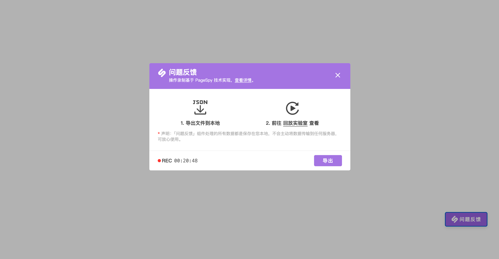

# `@huolala-tech/page-spy-plugin-whole-bundle`



插件打包了三个依赖，一个脚本实现 _离线模式的 PageSpy、录制操作轨迹、支持导出离线日志_ 的功能:

- [@huolala-tech/page-spy-browser](../page-spy-browser/);
- [@huolala-tech/page-spy-plugin-data-harbor](../page-spy-plugin-data-harbor/);
- [@huolala-tech/page-spy-plugin-rrweb](../page-spy-plugin-rrweb/);

## 使用

### CDN 引入

- jsdelivr: https://cdn.jsdelivr.net/npm/@huolala-tech/page-spy-plugin-whole-bundle
- unpkg: https://unpkg.com/@huolala-tech/page-spy-plugin-whole-bundle

```html
<head>
  ...
  <!-- 以 jsdelivr 为例 -->
  >
  <script
    src="https://cdn.jsdelivr.net/npm/@huolala-tech/page-spy-plugin-whole-bundle"
    crossorigin="anonymous"
  ></script>

  <script>
    const $wholeBundle = new WholeBundle({
      /**
       * 悬浮球和弹窗上显示
       */
      title?: string;
      /**
       * - 在线图片: 'https://example.com/xxx.jpg'
       * - 相对路径: '../xxx.jpg'
       * - Data url: 'data:image/png;base64,xxxx...'
       */
      logo?: string;
      /**
       * 定制主题色
       */
      primaryColor?: string;
      /**
       * 是否自动渲染悬浮球
       */
      autoRender?: boolean;
    })
  </script>
</head>
```

### ESM 引入

- 安装

```bash
yarn add @huolala-tech/page-spy-plugin-whole-bundle

# OR

npm install @huolala-tech/page-spy-plugin-whole-bundle
```

- 使用

```ts
import WholeBundle from '@huolala-tech/page-spy-plugin-whole-bundle';
import '@huolala-tech/page-spy-plugin-whole-bundle/dist/index.css';

const $wholeBundle = new WholeBundle({
  /**
   * 悬浮球和弹窗上显示的标题
   */
  title?: string;
  /**
   * - 在线图片: 'https://example.com/xxx.jpg'
   * - 相对路径: '../xxx.jpg'
   * - Data url: 'data:image/png;base64,xxxx...'
   */
  logo?: string;
  /**
   * 定制主题色
   */
  primaryColor?: string;
  /**
   * 是否自动渲染悬浮球
   */
  autoRender?: boolean;
})
```
